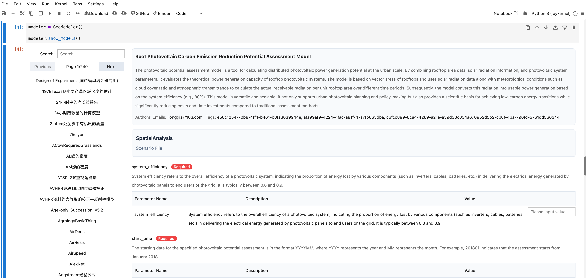

# PyGeoModel

[](https://github.com/yourusername/PyGeoModel/blob/main/LICENSE) [](https://pypi.org/project/PyGeoModel/) [](您的Colab链接) [](您的论文链接)

An intelligent Python package for geographic modeling within Jupyter 🌱

<table>
  <tr>
    <td colspan="3"><a href="您的演示链接"></a></td>
  </tr>
  <tr></tr>
  <tr align="center">
    <td><a href="您的演示链接">🚀 Live Demo</a></td>
    <td><a href="您的视频链接">📺 Talk Video</a></td>
    <td><a href="您的论文链接">📖 Research Paper</a></td>
  </tr>
</table>

## What is PyGeoModel?

PyGeoModel is an intelligent geographic modeling toolkit that provides **smart model recommendations** and **interactive GUI interfaces** for Jupyter Notebook environments.
With AI-powered model suggestions, contextual academic knowledge integration, and intuitive parameter configuration, PyGeoModel empowers researchers and practitioners to conduct geographic modeling more efficiently and intelligently.

<table>
  <td colspan="3">Components</td>
  <tr></tr>
  <tr>
    <td>🧠</td>
    <td><strong>Smart Model Recommender</strong></td>
    <td>AI-driven model suggestions based on user context and data</td>
  </tr>
  <tr></tr>
  <tr>
  <td>🖥️</td>
    <td><strong>Interactive GUI</strong></td>
    <td>Intuitive ipywidgets-based interface for model configuration</td>
  </tr>
  <tr></tr>
  <tr>
  <td>🤖</td>
    <td><strong>QA Assistant</strong></td>
    <td>Intelligent question-answering system for model guidance</td>
  </tr>
  <tr></tr>
  <tr>
  <td>📊</td>
    <td><strong>Model Execution Engine</strong></td>
    <td>Seamless integration with OGMS computational services</td>
  </tr>
  <tr></tr>
  <tr>
  <td>📚</td>
    <td><strong>Academic Integration</strong></td>
    <td>Real-time academic paper search and knowledge synthesis</td>
  </tr>
  <tr></tr>
</table>

## Get Started

### Live Demo

For a live demo, visit: <您的演示链接>.

### Computational Notebook

If you use computational notebooks (e.g., Jupyter Notebook, JupyterLab, Google Colab, VS Code Notebook), you can easily use PyGeoModel via its Python Package.

Visit this [Colab Notebook](您的Colab链接) for a demo.

```python
# Install PyGeoModel
!pip install PyGeoModel

from PyGeoModel import GeoModeler

# Create the intelligent modeling assistant
modeler = GeoModeler()

# Browse and select from available models
modeler.show_models()

# Get AI-powered model recommendations
modeler.suggest_model()

# Work with a specific model
modeler.invoke_model("SWAT_Model")
```

## How is PyGeoModel Built?

PyGeoModel is built with a modular architecture that combines [ipywidgets](https://ipywidgets.readthedocs.io/) for interactive interfaces, [asyncio](https://docs.python.org/3/library/asyncio.html) for asynchronous operations, and integration with external services. PyGeoModel uses [OpenAI API](https://openai.com/api/) and [Dify API](https://dify.ai/) for intelligent recommendations. The model execution is powered by [OGMS](http://geomodeling.njnu.edu.cn/) (Open Geographic Modeling Service). The academic integration leverages [Consensus API](https://consensus.app/) for real-time paper search. The computational notebook support is optimized for [Jupyter](https://jupyter.org/) environments.

## Credits

PyGeoModel is a result of collaboration between researchers from multiple institutions. PyGeoModel is created by <a href='mailto:llonggis@163.com' target='_blank'>Peilong Ma</a>, <a href='#' target='_blank'>Min Chen</a>, <a href='#' target='_blank'>Wei Xie</a>, and other contributors from Nanjing Normal University.

## Citation

To learn more about PyGeoModel, please read our [research paper](您的论文链接).

```bibtex
@article{
  title={PyGeoModel: A Python Package for Integrating Intelligent Geographic Model Services into Jupyter},
  author={Peilong Ma, Min Chen, Wei Xie, Dichen Liu, Tianyu Sheng, Yongning Wen, Songshan Yue, Guonian Lv},
  journal={arXiv},
  year={2025},
  url={您的论文链接}
}
```

## License

- The software is available under the [MIT License](https://github.com/yourusername/PyGeoModel/blob/main/LICENSE).
- The model configurations and examples are provided for research and educational purposes.

## Contact

If you have any questions, feel free to open an issue or contact [Peilong Ma](mailto:llonggis@163.com).
